# to-squash-or-not-to-squash

## Motivation

While squashing to develop helps maintain a linear history, it introduces other challenges in the typical git-flow strategy:

* You can't bisect
* When develop is merge commited to main (aka. master), on the next PR you're required to merge down an empty PR
* Which is not an issue, unless the develop branch is also proctected, which adds to non-value-added busy work.

## The experiments

We will create **8 pull-requests (PRs)** total, the first 4 PRs (dev->main->dev-main) will NOT be squashed, the last 4 will be squashed.

We want to test if merge commit to develop avoids an empty down-merge to develop on the second set of PRs.

Additionally we want to show that squashing necessitates an empty down merge.

*This line marks the first commit to feature*

### NO Squash

#### Observations

##### First Release

First PR (feature-1 to develop)

**NO CONFLICT**

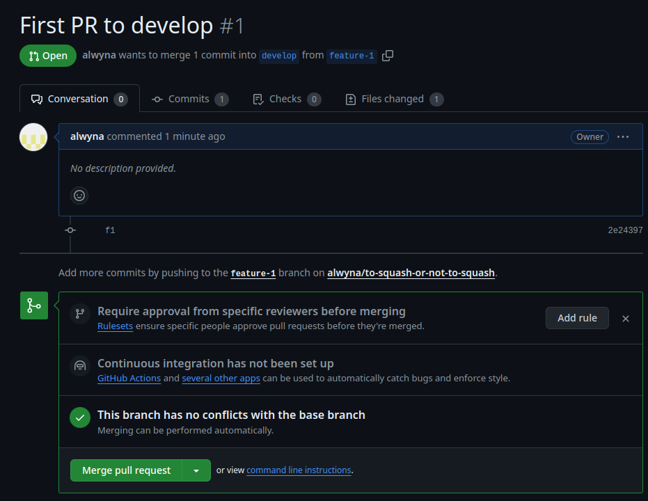

Second PR (develop to main)

**NO CONFLICT**

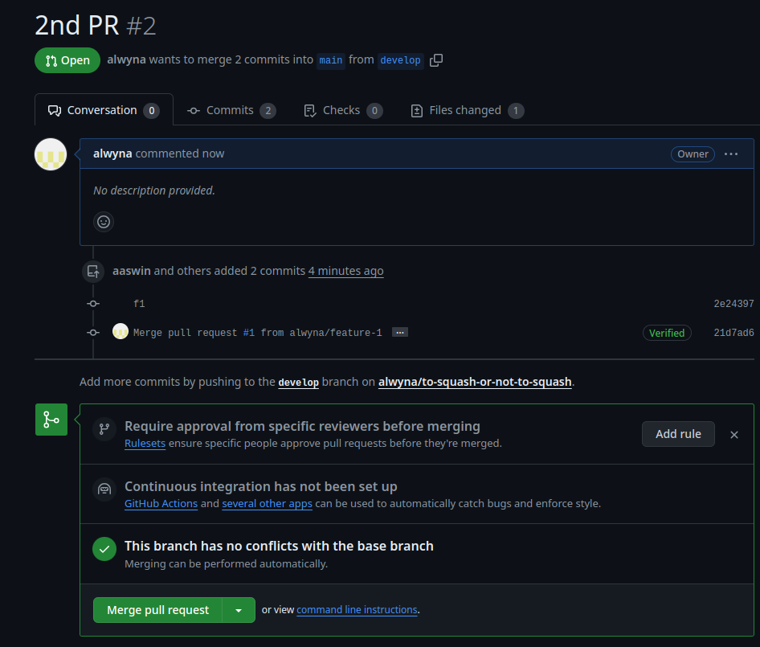

##### Second Release

We branched off develop that had the merge commit from `feature-1`

> ~/workspace/to-squash-or-not-to-squash$ git checkout -b feature-2
Switched to a new branch 'feature-2'

*This line marks the commit to feature-2*

#### Observations

Third PR (feature-2 to develop)

**NO CONFLICT**

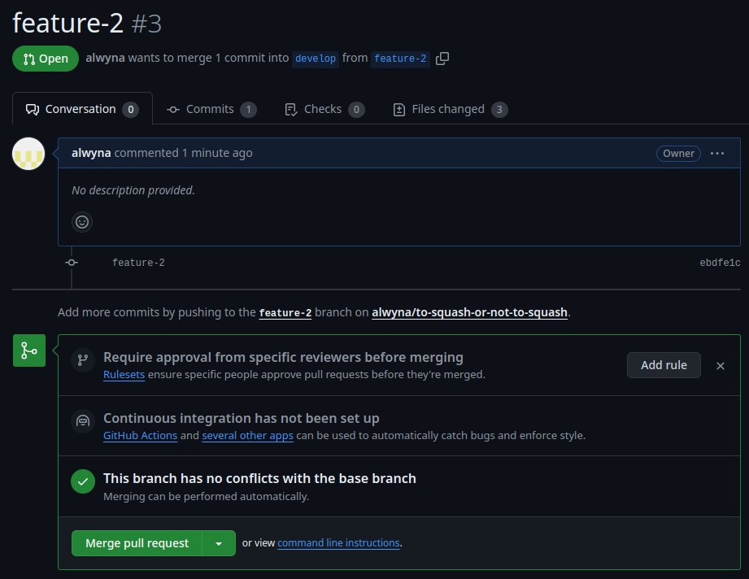

Fourth PR (develop to main) **!MOMENT OF TRUTH!**

**NO CONFLICT**

Merge committing from feature-> develop -> main does **NOT** cause the empty down-merge issue.

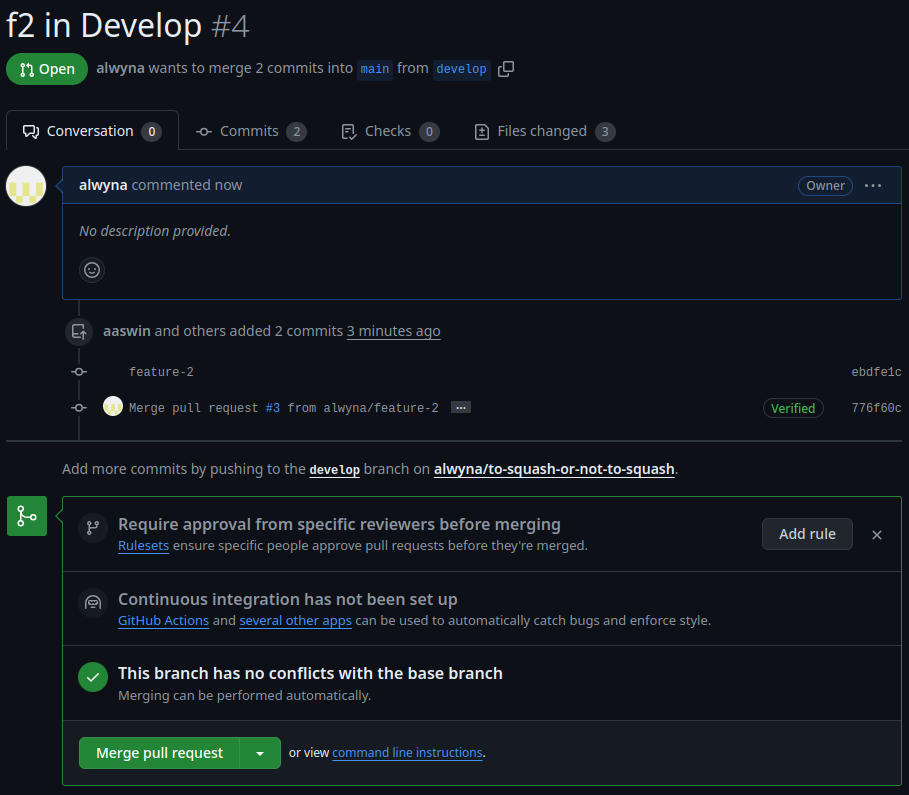

## SQUASHING

To show that squashing results in merge conflicts with no file on the subsequent merge to main.

We branched off develop that had the merge commit from `feature-2`

> ~/workspace/to-squash-or-not-to-squash$ git checkout -b feature-3
Switched to a new branch 'feature-3'

*This line marks the commit to feature-3*

Fifth PR (feature-3 to develop)

**NO CONFLICT, squashing!**

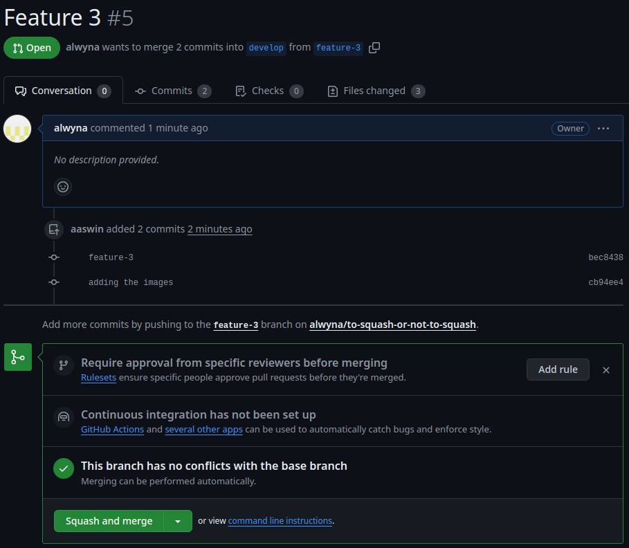


Sixth PR (develop to main)

**NO CONFLICT, and NOT squashing (merge commit)**

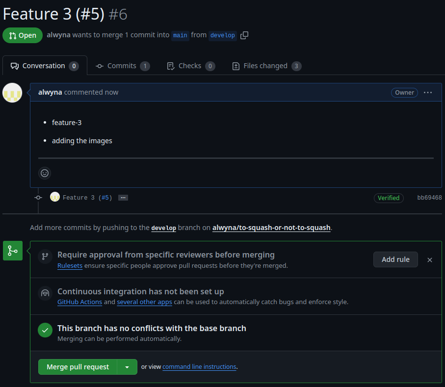

to be precise:


*this line marks the end of the feature 4*

Seventh PR (feature-4 to develop)

**NO CONFLICT, squashing!**

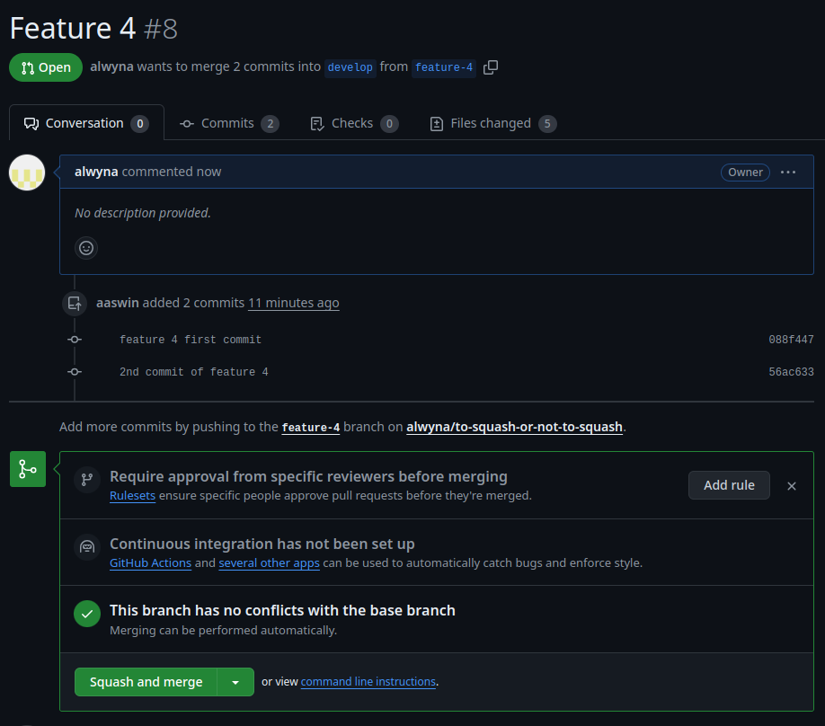

to be precise:

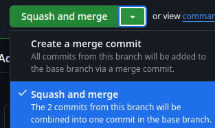

Eight PR (develop to main)

**NO CONFLICT, and NOT squashing (merge commit)**

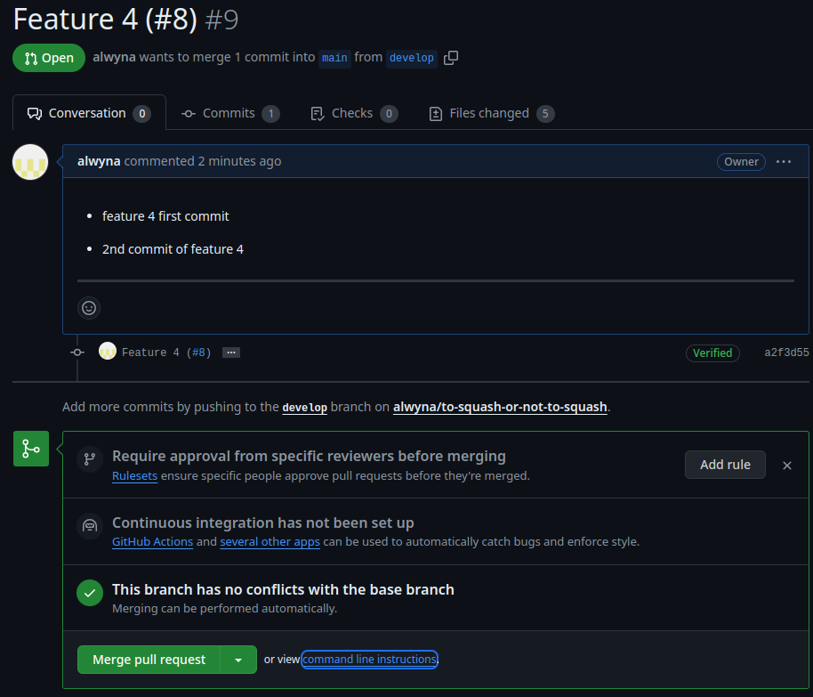

Regular merge

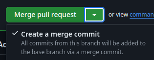

*We were expecting a conflict at this point but there is NONE!*

However I suspect a conflict is brewing as there is now a merge commit that is not in develop see:

Notice the most recent commit hash `1846048` is not found in the squashed develop branch, also observe that when develop is merge commited (`feature-1`,`feature-2`), there is *no unique hash, that exists only in main*.

|Main|Develop|
|----|:-----:|
|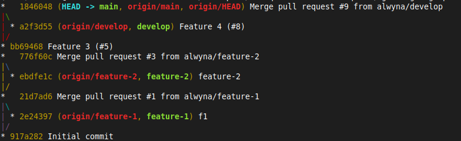| 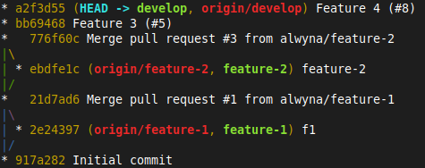|

To try and trigger the necessary empty down merge, we are going to squash these changes to develop via. PR and make another PR to main, expecting a conflict. To do that, we are going pull latest from `develop` and create a new `feature-5` branch.

*this line marks the end of the feature 5*


Ninth PR (feature-5 to develop)

**NO CONFLICT, squashing!**

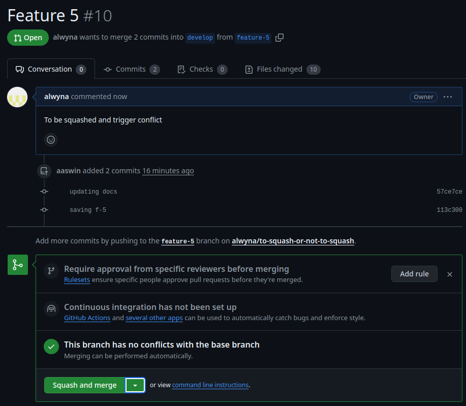


Tenth PR (develop to main)

**CONFLICTED**

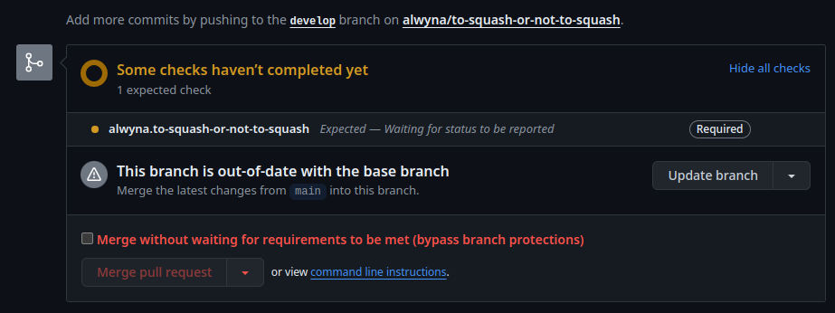

However this did not trigger immediately as expected it also required the addition of:

* Branch protection rule must be enabled with `Require branches to be up to date before merging`

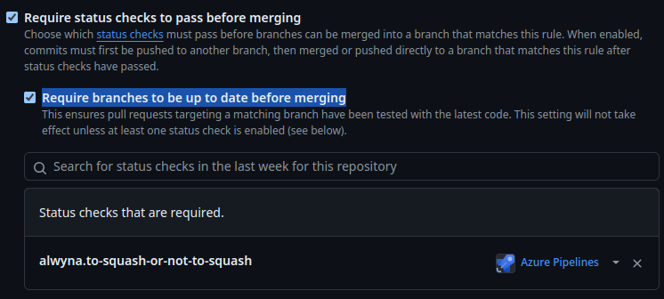


# Conclusion

## Blank down merges

Squashing to develop while using gitflow to keep a linear history has a few drawbacks

1. When `feature -> squash -> develop` is followed by `develop -> merge commit -> main`, a new commit is created in `main`.
2. The commit would then prevent subsequent merge to `main` from `develop`, w/o first updating the `develop` branch if `Require branches to be up to date before merging`, branch protection rule is enabled.
3. Even though `main` and `develop` are 100% identical, they require a down merge. Nonetheless, this is typically a button click away unless:
   1. `develop` is also a protected branch and
   2. the user who submitted the PR does not have the privilege to update `develop`


To illustrate the point, the commit `776f60c` was created by the workflow `feature-2 -> merge commit -> develop -> merge commit -> main`, this commit exists in all the relevant branches

```bash
git branch -r --contains 776f60c
  origin/HEAD -> origin/main
  origin/azure-pipelines
  origin/develop
  origin/feature-3
  origin/feature-4
  origin/feature-5
  origin/main
```

Not so for commit `1846048` which was created as a result of a merge commit from a squash to develop in the workflow `feature-4 -> squash -> develop -> merge commit -> main`

```bash
git branch -r --contains 1846048
  origin/HEAD -> origin/main
  origin/azure-pipelines
  origin/main
```

The above results in busy-work, as `1846048` has to be down-merged to develop even though the code at this point and develop at commit `a2f3d55` is exactly identical.

```bash
git branch -r --contains a2f3d55
  origin/HEAD -> origin/main
  origin/azure-pipelines
  origin/develop
  origin/feature-5
  origin/main

git diff 1846048 a2f3d55  # Is empty
```

## Punitive when work is started on old branch.


Merging is impossible, even locally. Case in point. A developer started working on a sprint story, but forgot to run `git checkout -b feature-x`, realizing after the fact, he tried to `fetch` and `merge` latest from develop like this.

```bash
git reset --hard origin/feature-4                                             
HEAD is now at 56ac633 2nd commit of feature 4
git fetch
git merge origin/develop
Auto-merging README.md
CONFLICT (content): Merge conflict in README.md
```

Going back even further in time to `feature-2`, a branch that was never squashed to develop

```bash
t checkout feature-2                
Switched to branch 'feature-2'                                                                                         
Your branch is up to date with 'origin/feature-2'.                                                                     
git merge origin/develop              
Updating ebdfe1c..6f50bf5                                                                                              
Fast-forward                                                                                                           
 README.md    |  85 ++++++++++++++++++++++++++++++++++++++++++++++++++++++++++++++++++++++++++++++++++++-              
 image-10.png | Bin 0 -> 20508 bytes                                                                                   
 image-11.png | Bin 0 -> 104901 bytes                                                                                  
 image-12.png | Bin 0 -> 103110 bytes                                                                                  
 image-13.png | Bin 0 -> 13456 bytes                                                                                                                                                                                                           
 image-14.png | Bin 0 -> 43974 bytes                                                                                   
 image-15.png | Bin 0 -> 43974 bytes                                                                                   
 image-16.png | Bin 0 -> 32083 bytes                                                                                   
 image-2.png  | Bin 0 -> 95074 bytes                                                                                   
 image-3.png  | Bin 0 -> 109728 bytes                                                                                  
 image-4.png  | Bin 0 -> 103998 bytes                                                                                                                                                                                                                                                                                                                                                                                                                                                         
 image-5.png  | Bin 0 -> 11030 bytes                                                                                   
 image-6.png  | Bin 0 -> 101328 bytes                                                                                  
 image-7.png  | Bin 0 -> 2883 bytes                                                                                    
 image-8.png  | Bin 0 -> 104812 bytes                                                                                  
 image-9.png  | Bin 0 -> 2934 bytes                                                                                    
 16 files changed, 84 insertions(+), 1 deletion(-)                                                                     
 create mode 100644 image-10.png                                                                                       
 create mode 100644 image-11.png                                                                                       
 create mode 100644 image-12.png                                                                                       
 create mode 100644 image-13.png                                                                                       
 create mode 100644 image-14.png                                                                                       
 create mode 100644 image-15.png                                                                                       
 create mode 100644 image-16.png                                                                                       
 create mode 100644 image-2.png                                                                                        
 create mode 100644 image-3.png                                                                                        
 create mode 100644 image-4.png                                                                                        
 create mode 100644 image-5.png                                                                                        
 create mode 100644 image-6.png                                                                                        
 create mode 100644 image-7.png                                                                                        
 create mode 100644 image-8.png                                                                                        
 create mode 100644 image-9.png                                                            
```

*Automatic fast-forward*. Even with all those extra changes, it's easy.

The irony here is that a branch that's closer to `develop`, `feature-4` is *harder* to merge, than `feature-2` that is older and further apart, was automatically merged w/o manual intervention.

## Other issues and possible solutions

A screen grab from [SO](https://stackoverflow.com/questions/41139783/gitflow-should-i-squash-commits-when-merging-from-a-release-branch-into-master) indicates that originally there was never any mention of squash in gitflow:

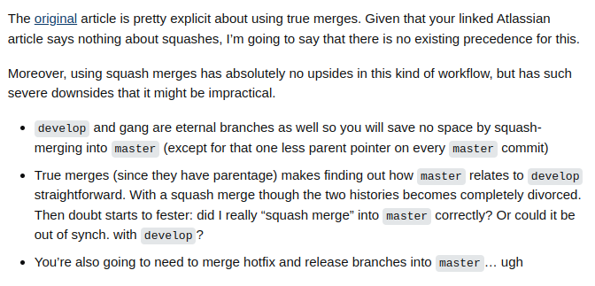

And following the [link](https://nvie.com/posts/a-successful-git-branching-model/) mentioned in the post I was able to corroborate:

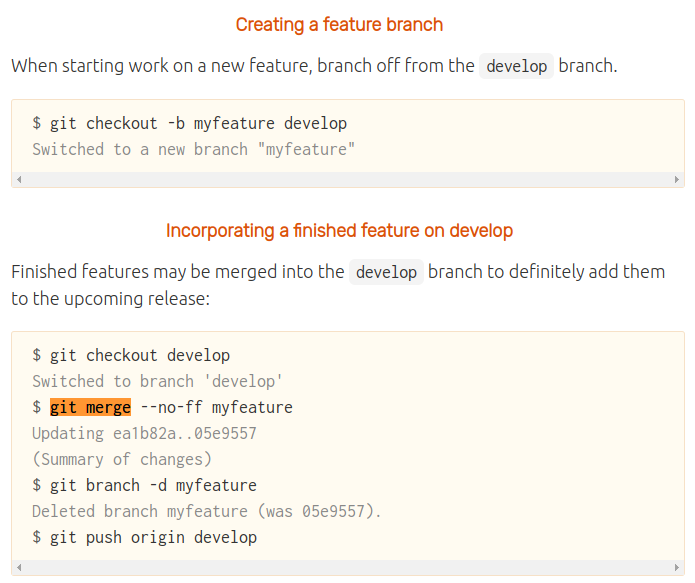

Same with the [atlassian article on gitflow](https://www.atlassian.com/git/tutorials/comparing-workflows/gitflow-workflow)

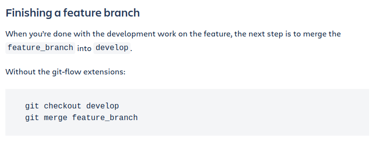

Other posters in SO highlighted other drawbacks with squashes in PRs:

1. It keeps you from putting `git bisect` in your toolbox
2. Could have simply used tags - less destructive

## Alternatives and solutions

The empty downmerge problem requires 3 ingredients to be present, gitlfow, squash and branch protection.

1. So one option is to simply disable the branch-protection rule
2. Another option is to not squash
3. If none of the formers is palatable, we can look at alternatives to gitflow such as: 
   1. [TBD](https://trunkbaseddevelopment.com/) or 
   2. [1-flow](https://www.endoflineblog.com/oneflow-a-git-branching-model-and-workflow)


TBD especially since to have significant support in this [devops reddit threads/polls](https://www.reddit.com/r/devops/comments/12adkyc/which_branching_strategy_are_you_currently_using/)

Every workflow typically has pros and cons. For example squashing help keep a linear history which could help in readability. Unfortunately, finding out the trade-offs usually requires time and experimentation. Given that I'm fairly new to TBD and 1-flow, I will leave my assessment of those other models to another post.


   


